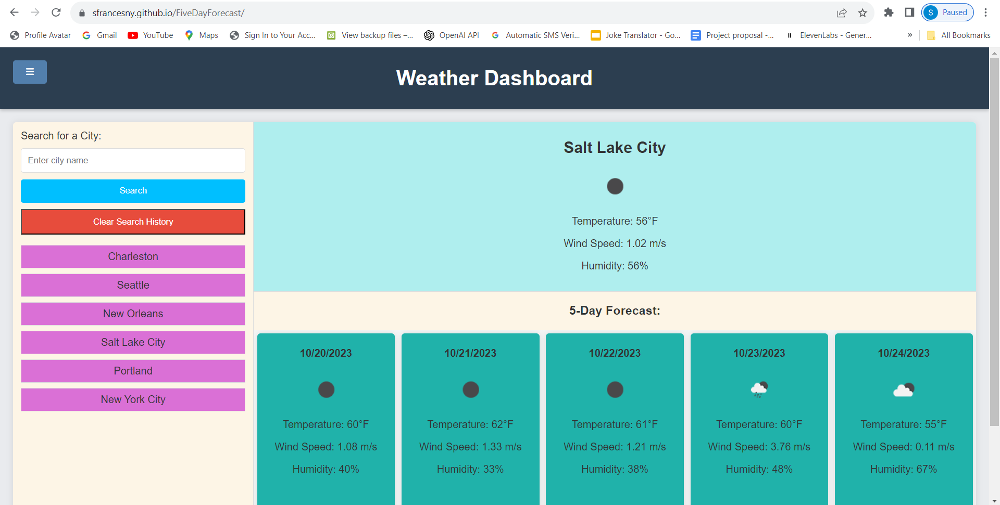
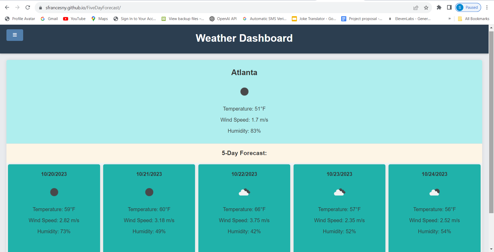

# 06 Server-Side APIs Challenge: Weather Dashboard
<!-- On-the-job ticket or feature request Challenges -->

## Description 
The Weather Dashboard is a travel-friendly application designed to provide travelers with both current and future weather outlooks for multiple cities. This tool equips users with up-to-date weather information that can assist them in making informed decisions about their trips.

## User Story
AS A traveler
I WANT to see the weather outlook for multiple cities
SO THAT I can plan a trip accordingly

## Acceptance Criteria
GIVEN a weather dashboard with form inputs
WHEN I search for a city
THEN I am presented with current and future conditions for that city and that city is added to the search history
WHEN I view current weather conditions for that city
THEN I am presented with the city name, the date, an icon representation of weather conditions, the temperature, the humidity, and the the wind speed
WHEN I view future weather conditions for that city
THEN I am presented with a 5-day forecast that displays the date, an icon representation of weather conditions, the temperature, the wind speed, and the humidity
WHEN I click on a city in the search history
THEN I am again presented with current and future conditions for that city

## Usage 
Weather Search - Key in the name of any city
Current Weather Display - After entering a city and initiating a search, users are shown the current weather conditions (temperature, humidity, windspeed, etc) for that specific city. 
Future Weather Outlook - 5-day forecast for the chosen city.
Local Storage / Search History Interaction - Users can then revisit the weather data from previously searched cities by clicking on city name

 ## Screenshots

 

Link: https://sfrancesny.github.io/FiveDayForecast/

## Resources
Xpert Learning Assistant
